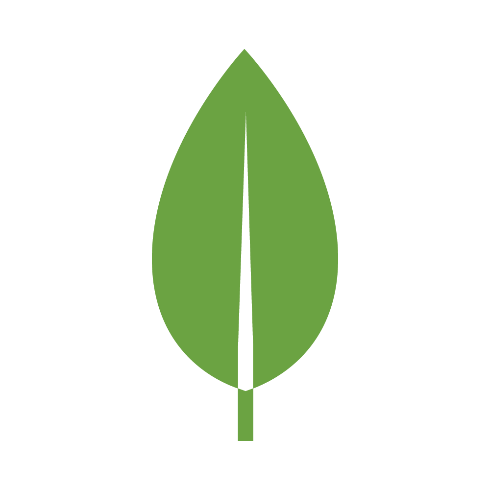
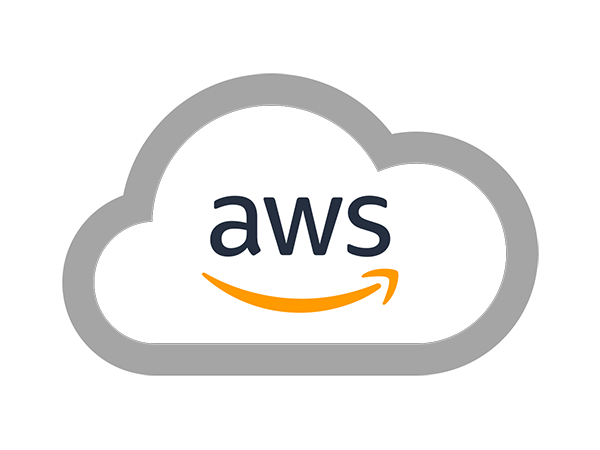
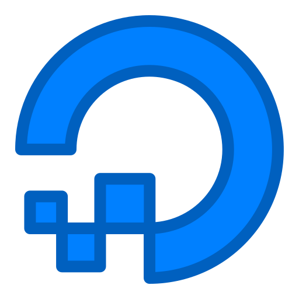
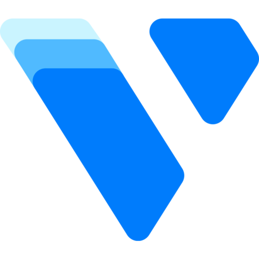

## About
Hello, I am full stack developer, working on multiple open source projects, mainly backend using Node.JS and Mongodb. I have created a range of Discord BOT applications allowing me to become a Verified Discord Bot Developer.

## Contact
* Twitter - [@LachlanDev](https://twitter.com/LachlanDev)
* Discord Server - [Invite Link](https://discord.com/invite/w7B5nKB)
* Website - [lachlan-dev.com](https://lachlan-dev.com/)
* Email - mail@lachlan-dev.com
* Discord - LachlanDev#8014

### Languages and Tools:

 
 

